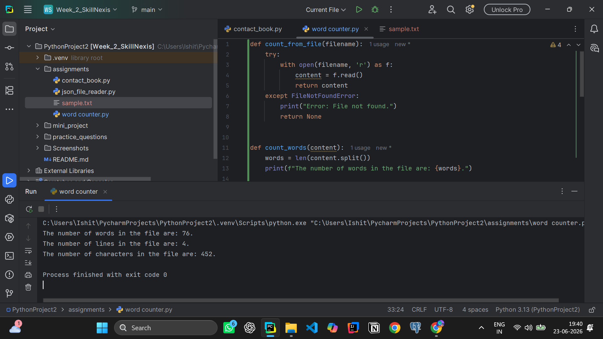
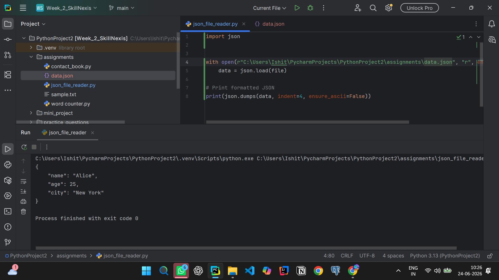
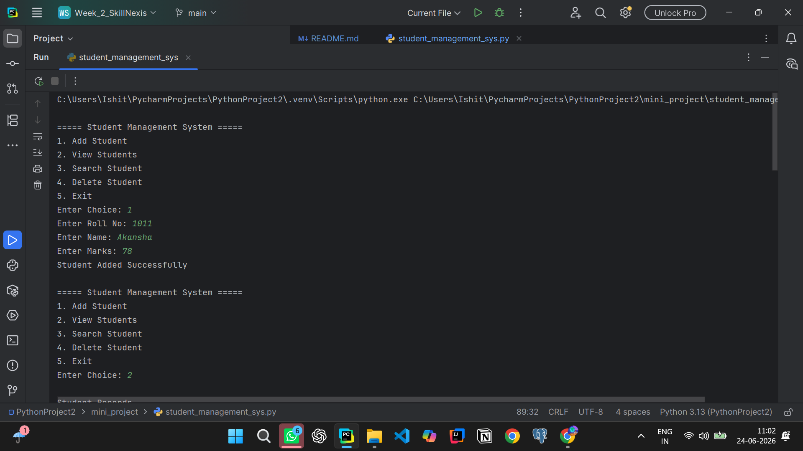
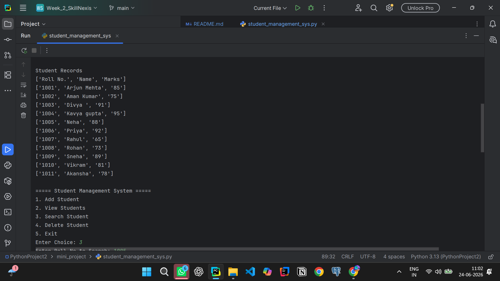
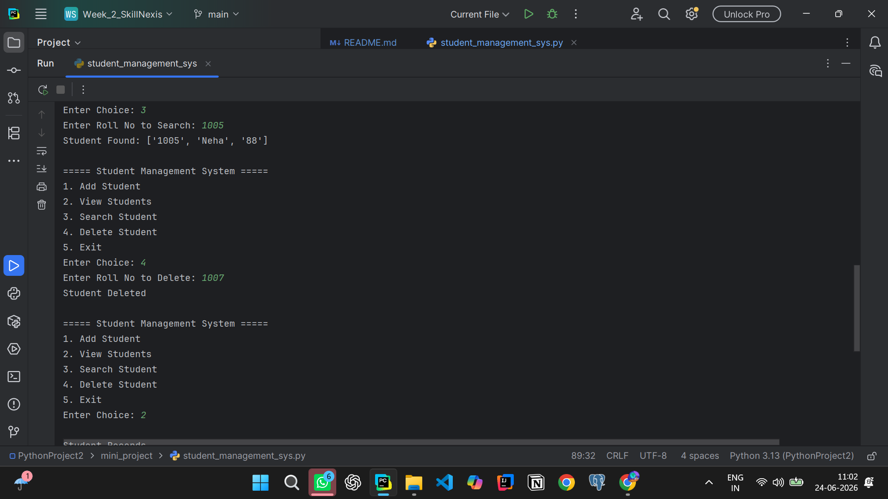
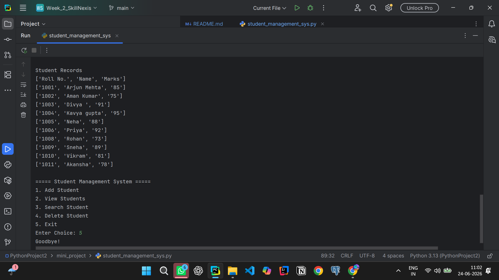

# Week 2
##### This week's course focuses on mainly Lists, Tuples, Dictionaries, File I/O, JSON.
##### Topics Covered:- 
1. Lists, Tuples, Sets, Dictionaries
2. Reading & Writing files
3. Working with CSV/JSON
4. Exception Handling

---

## Practice Questions 
1) Create a list and perform CRUD operations.

2) Write a dictionary program to count word frequency.

3) Use Nested loops to print pattern.

4) Find largest and smallest number in a list.

5) Sort a list using sort() and lambda key.

---

## Assignment
1)Contact Book using Dictionary
(Add, search, update, delete contacts.)

2)Word Counter from Text File
(Count number of words, lines, and characters.)

3)JSON File Reader
(Load JSON data & print formatted output.)

---
# MINI PROJECT
- This Mini Project is a "STUDENT MANAGEMENT SYSTEM" which stores students data like name ,roll no. , and marks .
- It has CRUD Operations in it.
- Save changes permanently to file.

---
## Working
- The program uses a CSV file (students.csv) as a simple database.
- Add student appends the data in the file.
- Search functions finds the data in the file.
- The delete functions removes the data from the file.

---

##  Output:-

---

## Learning Outcomes
- File Input/Output (I/O) operations in Python.
- Reading from and writing to CSV files.
- Implementing CRUD operations.
- Building a menu-driven console application.
- Working with functions and loops.

---
Here it ends my Week 2 Task For Skill Nexis.

## Author:
-Ankita Sanyal
