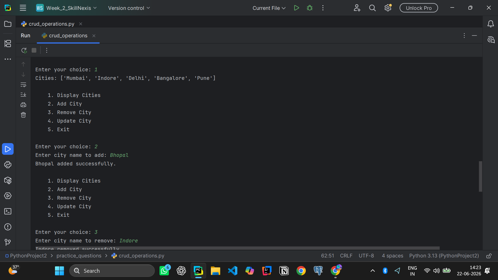
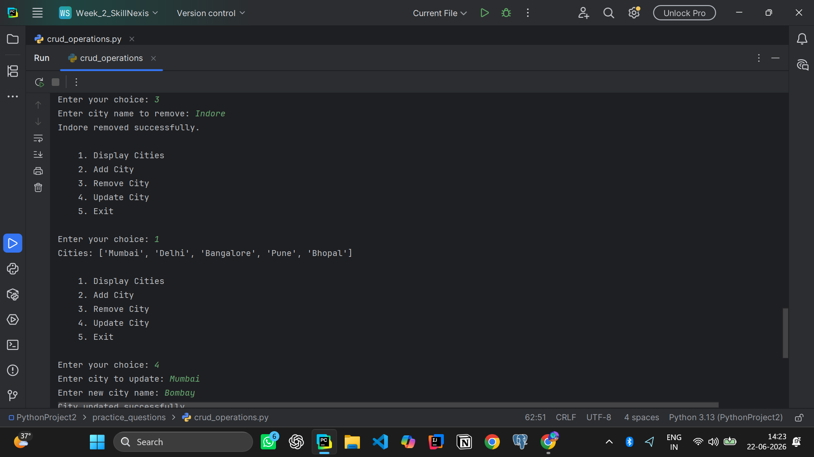
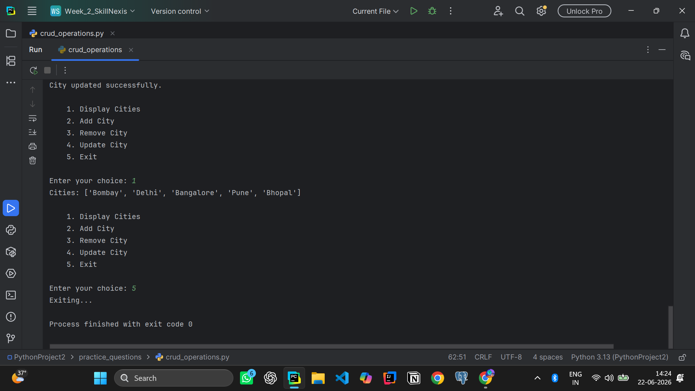
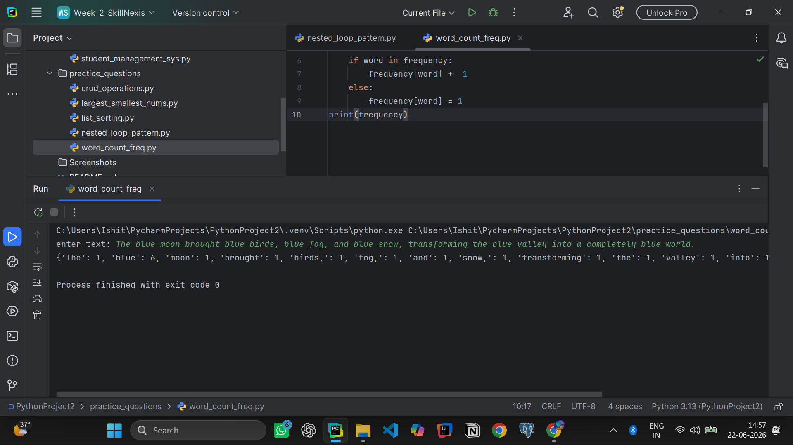
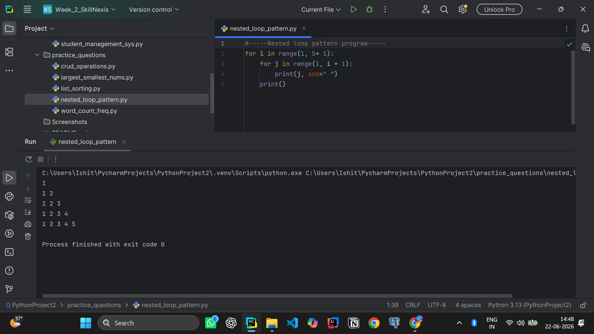
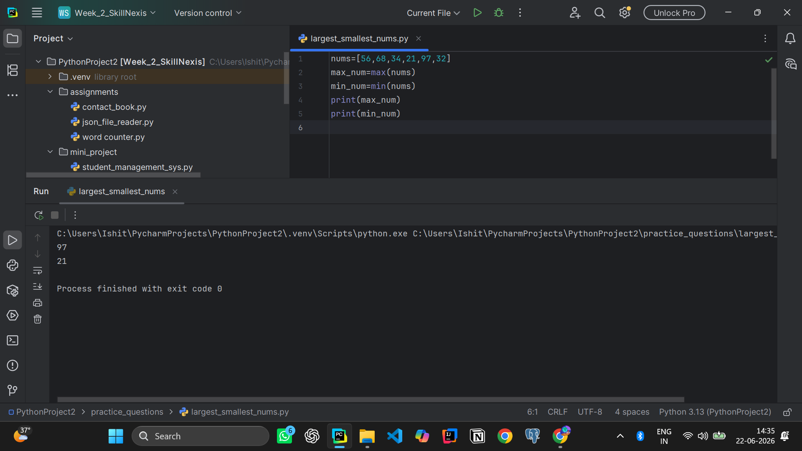
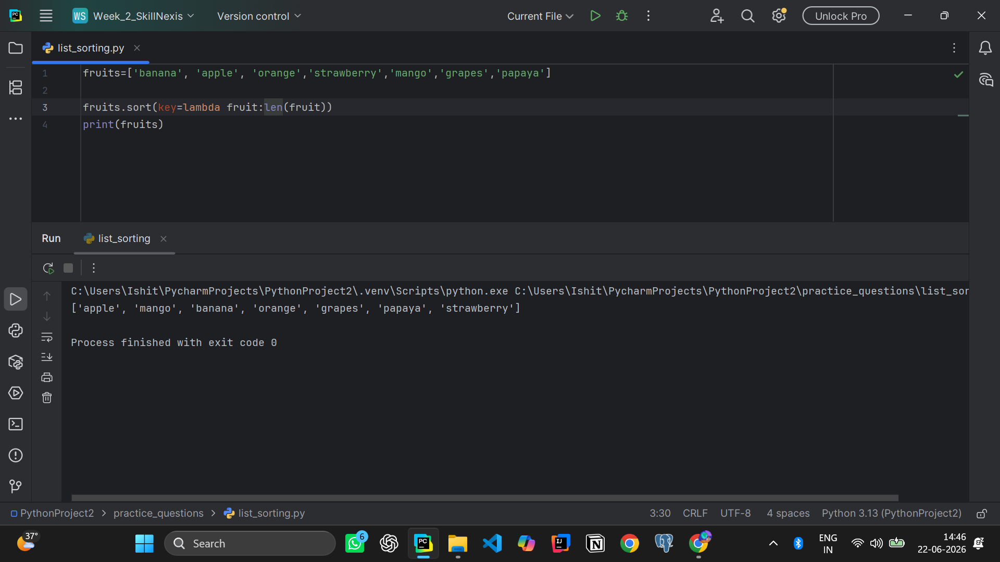
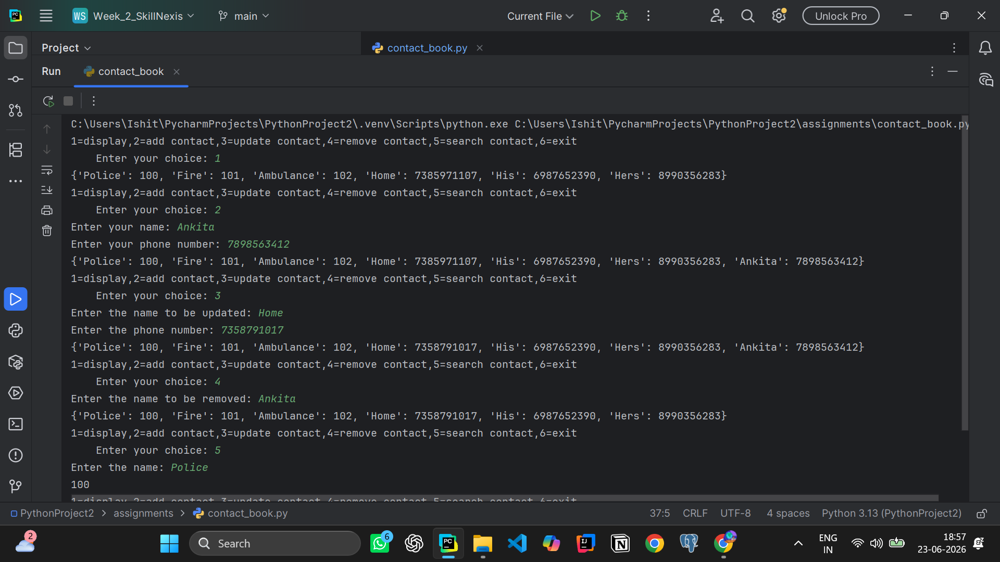
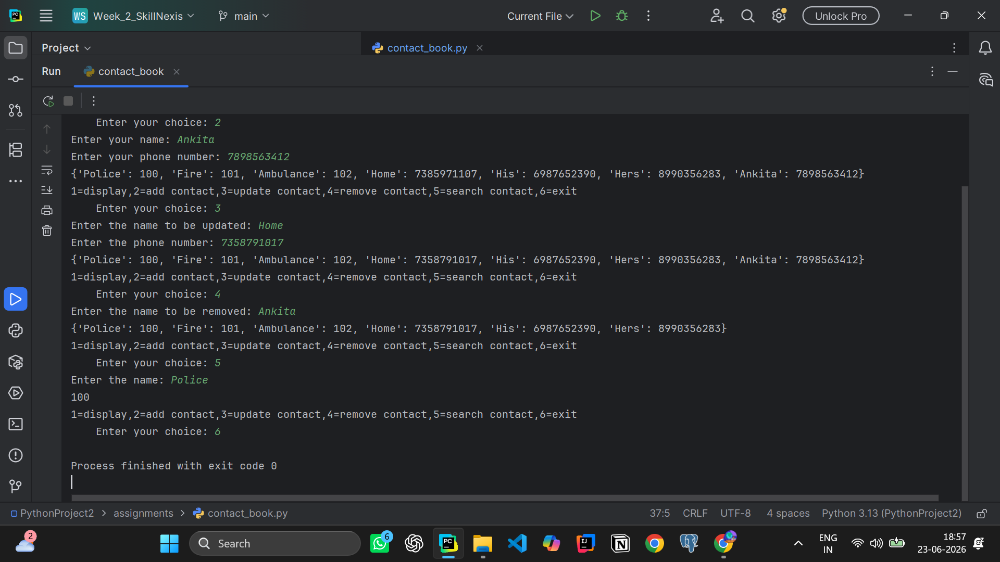

# Week 2
##### This week's course focuses on mainly Lists, Tuples, Dictionaries, File I/O, JSON.
##### Topics Covered:- 
1. Lists, Tuples, Sets, Dictionaries
2. Reading & Writing files
3. Working with CSV/JSON
4. Exception Handling

---

## Practice Questions 
1) Create a list and perform CRUD operations.

2) Write a dictionary program to count word frequency.

3) Use Nested loops to print pattern.

4) Find largest and smallest number in a list.

5) Sort a list using sort() and lambda key.

---

## Assignment
1)Contact Book using Dictionary
(Add, search, update, delete contacts.)

